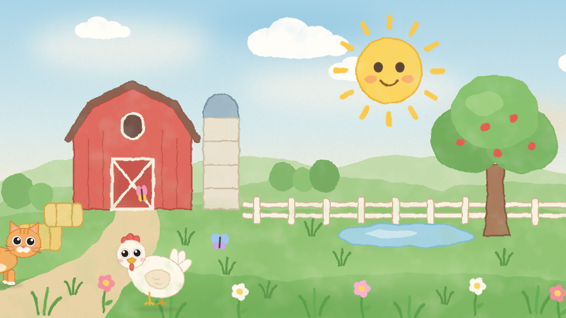

# Farm friends loop

A low-stimulation farm video for a toddler, built with [Remotion](https://www.remotion.dev).
A painted farm sits still while the sun breathes, clouds drift and grass sways. Every
twelve seconds one animal walks in slowly, stops, does one small thing (a couple of soft
hops, a nibble of grass, or a gentle wing flap), and walks off. Eleven animals take turns:
cow, horse, donkey, pig, sheep, goat, dog, cat, rabbit, chicken and duck.

The video is a seamless 3-minute loop. Repeating it twenty times gives an hour with no
visible seam, because every ambient motion has a period that divides the loop length
and the animal schedule wraps around it.

A quiet generated lullaby plays underneath: a music-box melody in C major pentatonic
at 60 beats per minute over soft bass notes, ending on a chord that rings out into
a short silence right at the loop seam. There is no text and nothing fast. Colours, speeds and counts live in
`src/config.ts` if you want it calmer or busier.



## Render

```bash
npm install
npm run render:loop     # out/farm-loop.mp4, 3 minutes, 1080p30
npm run hour            # repeats the loop 20x with ffmpeg, no re-encode -> out/farm-hour.mp4
```

`npm start` opens Remotion Studio to scrub through the loop. `npm run render:preview`
renders the first 30 seconds for a quick check. Rendering the whole hour in one go
(`npm run render:hour`) also works but takes twenty times longer than the loop; the
ffmpeg route is the one to use.

Rendering needs a machine with a few GB of RAM. A 3-minute loop is 5,400 frames; on
a laptop expect roughly 10 to 20 minutes.

## How it is put together

- `public/farm-backdrop.svg`: the still watercolor farm, drawn once as an image.
- `src/Ambient.tsx`: sun, clouds, butterflies, grass and flowers, driven by the frame clock.
- `src/schedule.ts`: a deterministic list of visits (which animal, when, from which side,
  where it stops). Consecutive visitors never share a depth lane or a stop column, so
  overlaps always stack correctly.
- `src/motion.ts`: turns a time into a pose: walk cycle tied to distance walked, easing
  in and out of the stop, breathing, blinking and the stop behavior.
- `src/animals/AnimalSprite.tsx`: draws one animal from its layers (shadow, tail, legs,
  body, wing, head, eyes).
- `src/animals/data.ts` and `src/ambient-data.ts`: the artwork, extracted from the
  "Farm friends" slide deck by the two scripts in `scripts/`.

## Music

`public/music.mp3` is generated, not recorded. `npm run music` rebuilds it from
`scripts/make-music.mjs`, where the tune is written as bars of notes; change the notes,
the tempo or the instruments there and rerun it. The file is exactly the loop length.

After any music change, `npm run remux` swaps the new audio into an already rendered
`out/farm-loop.mp4` in seconds, without re-rendering frames. Then `npm run hour` again.

## Tuning

| Setting | Where | Effect |
| --- | --- | --- |
| `MUSIC_VOLUME` | `src/config.ts` | lullaby volume, 1 = as generated (about -14 dBFS RMS), 0 for silence |
| `VISIT_GAP` | `src/config.ts` | seconds between animals (12 keeps at most two on screen) |
| `WALK_SPEED` | `src/config.ts` | walking speed in px/s (160; the deck used 300) |
| `PAUSE_SECONDS` | `src/config.ts` | how long each animal stays put |
| `LOOP_SECONDS` | `src/config.ts` | loop length; ambient periods in `Ambient.tsx` must divide it |
| `SCHEDULE_SEED` | `src/config.ts` | a different seed gives a different order of visits |
| `behavior` per animal | `src/config.ts` | `hop`, `graze` or `flap` |
